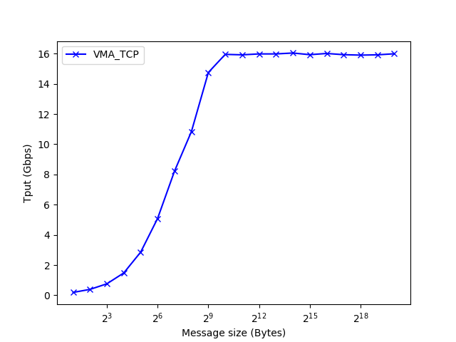
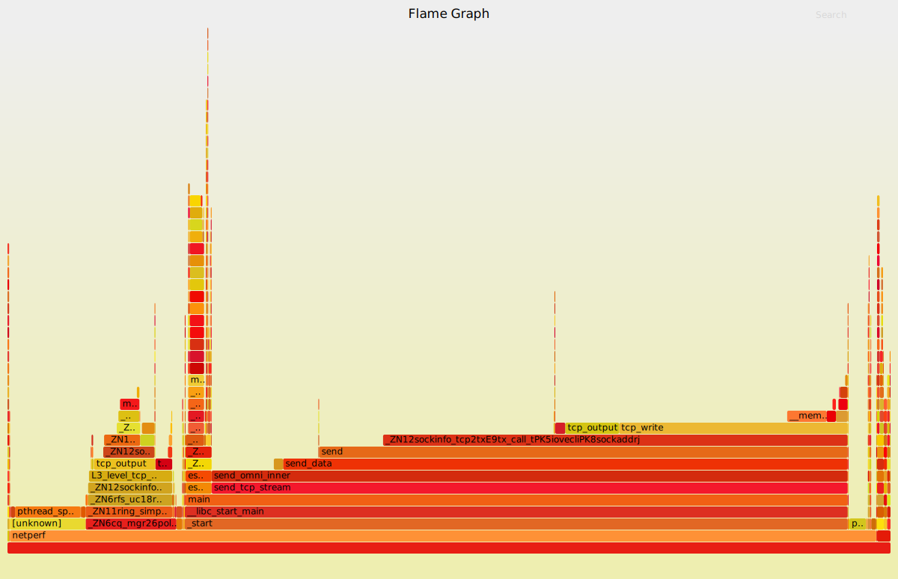
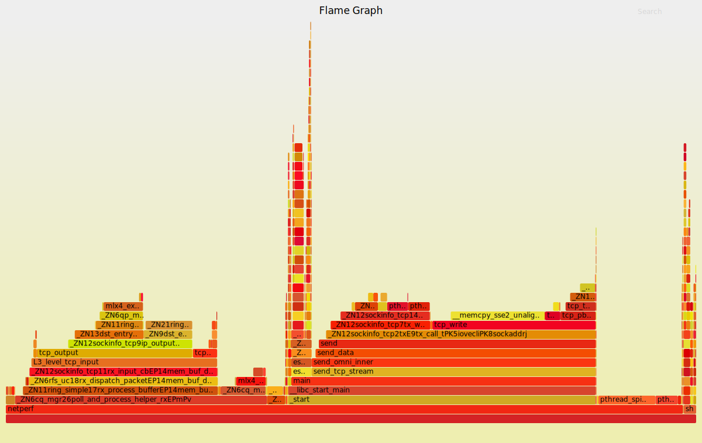

# Understanding libvma

## Benchmarking libvma

### Setup

- Two nodes and each equipped with one Mellanox ConnectX-3. Details:

```
$ ofed_info -s
MLNX_OFED_LINUX-4.0-2.0.0.1:

$ lspci | grep Mellanox
01:00.0 Network controller: Mellanox Technologies MT27500 Family [ConnectX-3]

$ ibstatus
Infiniband device 'mlx4_0' port 1 status:
	default gid:	 fe80:0000:0000:0000:e41d:2d03:00e4:d711
	base lid:	 0x1
	sm lid:		 0x1
	state:		 4: ACTIVE
	phys state:	 5: LinkUp
	rate:		 40 Gb/sec (4X FDR10)
	link_layer:	 InfiniBand

Infiniband device 'mlx4_0' port 2 status:
	default gid:	 fe80:0000:0000:0000:e41d:2d03:00e4:d712
	base lid:	 0x0
	sm lid:		 0x0
	state:		 1: DOWN
	phys state:	 2: Polling
	rate:		 10 Gb/sec (4X)
	link_layer:	 InfiniBand
```

### Micro-benchmarks

对于 Socket-to-Verbs 转换库，我们主要关注它的延迟和吞吐。对于 latency，只关注小包的延迟即 payload 为 1 字节的延迟。

#### Round-trip latency

```
# @server
$ ulimit -l unlimited
# -f    Do not spawn chilren for each test, run serially.
# -D    Do not daemonize.
# -L name,family Use name to pick listen addr and family for family.
# -4    Do IPv4.
$ NETSERVER=netserver -D -f -L 192.168.10.141 -4
$ VMA_SPEC=latency LD_PRELOAD=libvma.so $NETSERVER
    
# @client
$ ulimit -l unlimited
# Polling mode
$ NETPERF=netperf -t TCP_RR -H 192.168.10.141 -T 2 -l 30
$ VMA_SPEC=latency LD_PRELOAD=libvma.so $NETPERF
Local /Remote
Socket Size   Request  Resp.   Elapsed  Trans.
Send   Recv   Size     Size    Time     Rate         
bytes  Bytes  bytes    bytes   secs.    per sec   

0      87380  1        1       30.00    326928.12   
0      87380
```

由此可得 RTT 为 3.1 us。

#### Throughput

```
# @server
$ ulimit -l unlimited
$ NETSERVER="netserver -D -f -L 192.168.10.141 -4"
$ LD_PRELOAD=libvma.so $NETSERVER

# @client
$ ulimit -l unlimited
$ NETPERF="netperf -t TCP_STREAM -f g -H 192.168.10.141 -T 2 -l 10"
$ LD_PRELOAD=libvma.so $NETPERF -- -m $msg_size
```



如图，当 msg_size 超过 1KB 时，吞吐到达峰值 16Gbps。分别取 msg_size 为 64B 和 4KB，对 netperf 发送端进行 cost breakdown，如图，



